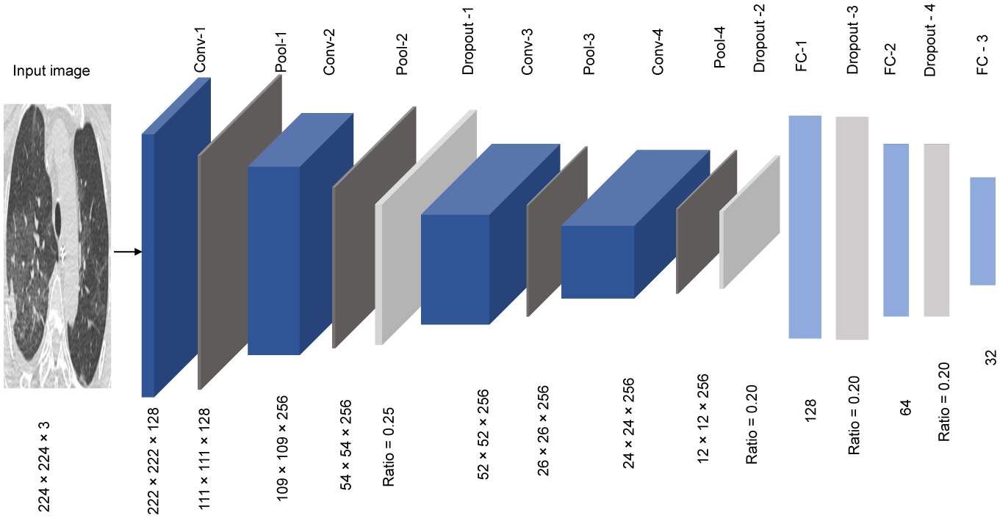

# Optimizing Computer Vision: Unveiling Tips and Tricks for Efficient Problem-Solving
###### (A Novel Way For Feature Extraction) 
###### [Paper Link](https://www.researchgate.net/publication/369118905_A_hybrid_CNN_and_ensemble_model_for_COVID-19_lung_infection_detection_on_chest_CT_scans)
### Background: The Limitations of Pre-Trained Models in Divergent Datasets 
While traditional computer vision approaches rely heavily on pre-trained models, particularly those from the IMAGE_NET domain, a critical limitation emerges when working with datasets outside this norm. 
The assumptions inherent in these models may lead to diminished performance and relevance when faced with unfamiliar domains. 

### Key Points: 

* IMAGE_NET Conundrum: Pre-trained models excel when the target problem aligns with the characteristics of IMAGE_NET. However, real-world datasets often deviate significantly. 

* Mismatched Datasets: Divergence from the IMAGE_NET norm results in suboptimal performance. Niche datasets, like medical imaging, challenge pre-trained models' adaptability. 

* Shift in Perspective: Recent research, as highlighted in the paper, advocates for a shift in perspective. The proposal involves exploring specialized feature extractors, acknowledging that not all problems benefit from the conventional reliance on pre-trained models. 

In this report, we delve into the implications of this shift, exploring innovative strategies for feature extraction and their potential to redefine efficient problem-solving in computer vision. 

## Case Snapshot: Revolutionizing COVID-19 Classification 

In the pursuit of solving COVID-19 classification, the paper challenges the status quo of relying on pre-trained models. The findings reveal a significant performance gap in larger, pre-trained models when applied to this specific medical imaging task. 

### Model Specifications:  

**Figure 1:** The proposed compact CNN model designed for Image features extraction

## Model Parameters: 

| Model        | Parameters (M) |
|--------------| --------------- |
| Inception V3 | 23.9            |
| VGG-19       | 138             |
| AlexNet      | 61              |
| ResNet-50    | 23              |
| DenseNet-201 | 20              |
| MobileNetV2  | 3.4             |
| Swish Model  | 6.2             |
**Table 1:** Comparison of model sizes.

## Performance Metrics

| Model                                         | Precision | Recall | F1      | Specificity |
|-----------------------------------------------| --------- | ------ | ------- | ----------- |
| MobileNetV2 (Transfer Learning)               | 96.70%    | 97.00% | 96.70%  | 96.80%      |
| MobileNetV2 (Feature Extraction) + RF         | 98.40%    | 99.20% | 98.80%  | 98.40%      |
| Proposed Model + LR                           | 98.80%    | 99.20% | 99.00%  | 98.80%      |
| Proposed Model + RF                           | 98.80%    | 99.20% | 99.00%  | 98.80%      |
| SIFT + Swish Model + LR                       | 99.20%    | 99.20% | 99.20%  | 99.20%      |
| SIFT + Swish Model + Bagging Method (SVM)           | 99.20%    | 99.60% | 99.40%  | 99.20%      |
| SIFT + Swish Model + Boosting Method (SVM) | 99.20%    | 99.20% | 99.20%  | 99.20%      |

**Table 2:** Testing scores of the proposed methods for COVID-19 classification.

| Model                          | Precision  | Recall     | F1         | Specificity | Accuracy   |
|--------------------------------|------------|------------|------------|-------------|------------|
| VGG16                          | 95.74%     | 95.23%     | 95.49%     | 95.67%      | 95.45%     |
| Inception ResNet               | 90.15%     | 92.06%     | 91.09%     | 89.72%      | 90.90%     |
| ResNet-152 V2                  | 92.92%     | 97.35%     | 95.09%     | 92.43%      | 94.91%     |
| DenseNet                       | 96.29%     | 96.29%     | 96.29%     | 96.21%      | 96.25%     |
| GLCM+encoder                   | 97.77%     | 98.77%     | 97.78%     | 96.78%      | 97.78%     |
| xDNN                           | 99.16%     | 95.53%     | 97.31%     | -           | 97.38%     |
| **SIFT+Swish Model+ (SVM)** | **99.20%** | **99.60%** | **99.40%** | **99.20%**  | **99.39%** |
| ResNet50                       | -          | -          | 91.43%     | -           | 82.64%     |

**Table 3:** Comparison of the proposed model and state-of-the-art DL-based models.

## Conclusion

In challenging the dominance of pre-trained models, this exploration champions a paradigm shift by spotlighting the prowess of feature extraction, notably the fusion of SIFT with the proposed compact CNN model. This strategic alliance, coupled with classical machine learning, particularly SVM, presents an innovative approach to problem-solving. 

* Feature Extraction Triumph: SIFT, coupled with the compact CNN model, excels in capturing nuanced details, surpassing larger, pre-trained models. 

* Classical ML Synergy: The integration with classical machine learning, especially SVM, proves pivotal, offering superior accuracy in classification tasks. 

Adaptive Problem-Solving: In datasets deviating from conventional norms, the proposed strategy emerges as a beacon for adaptive problem-solving, challenging the traditional reliance on pre-trained models. 

Charting a New Course: This journey signifies a departure from conventional thinking, advocating for creativity, adaptability, and nuanced dataset understanding. The marriage of feature extraction and classical machine learning charts a course toward precision and accuracy in computer vision problem-solving. 

In summary, the amalgamation of SIFT, purpose-built models, and classical machine learning heralds a transformative era in reshaping the computer vision landscape, urging us to venture into uncharted territories for innovative and precise solutions. 

## Requirements 
* PyTorch 
* NumPy

## Usage

### Domain-Specific Feature Extraction

The proposed feature extraction models are meticulously designed for a specific domain, ensuring optimal performance in capturing nuanced details. To utilize these models effectively, follow the steps below:

1. **Train the Output Layer:**
   - Add an output layer to the model, mapping the input to the target labels relevant to your specific domain.
   - Train the model from scratch using your domain-specific dataset to fine-tune the feature extraction capabilities.

2. **Fine-Tune and Adapt:**
   - After training, remove the output layer, leaving the model primed for feature extraction.
   - Utilize the model to extract domain-specific features from your images.

3. **Combine with Other Extractors:**
   - Enhance feature extraction capabilities by combining the model with other extractors such as SIFT.
   - Experiment with different combinations to achieve optimal results based on the characteristics of your dataset.

4. **Feed into Classical ML Models:**
   - Take the extracted features, especially those combined with SIFT, and feed them into any classical machine learning model, such as Support Vector Machines (SVM).
   - Leverage the power of classical ML to perform robust classification tasks on the extracted features.

By following this approach, you harness the power of purpose-built feature extraction, tailored to your domain, allowing for adaptability and precision in solving complex computer vision problems. This methodology encourages experimentation and fine-tuning to achieve the best outcomes for your specific use case.

